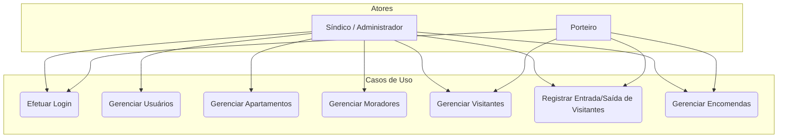
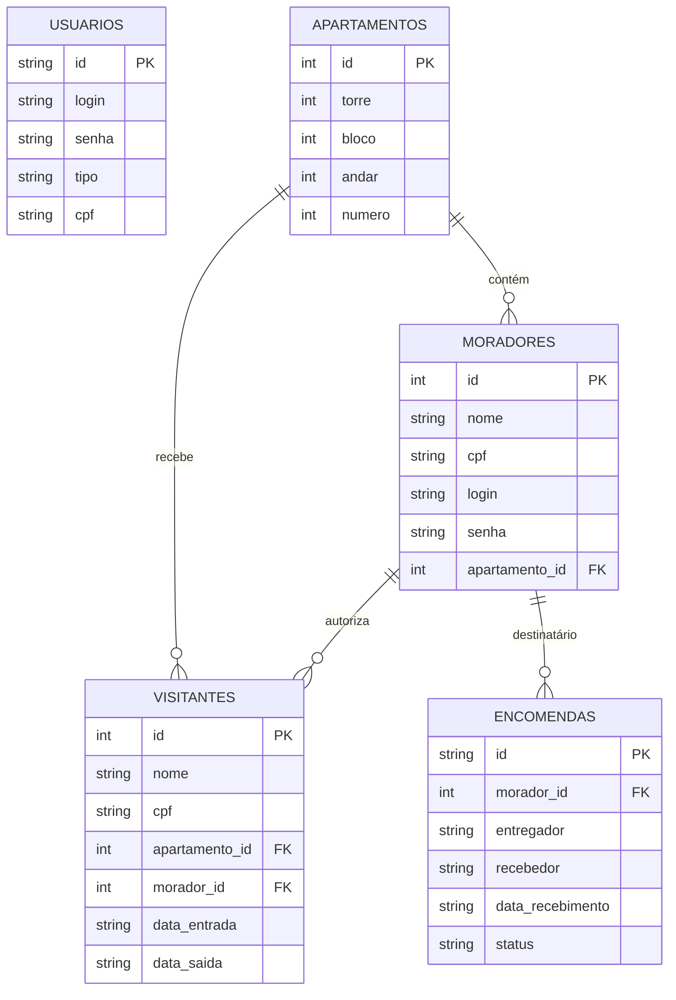

# Projeto de Curricularização da Extensão - Linguagem de Programação
**Sistema de Portaria - Condomínio Reserva da Aldeia**

## A) Cenário e Análise do Texto

**Cenário do Sistema:**
O Condomínio Reserva da Aldeia necessita de um sistema informatizado para gerenciar as rotinas diárias da portaria, com o objetivo de aumentar a segurança e melhorar o controle de acesso, que atualmente possui falhas devido a anotações manuais. O novo **sistema** deverá permitir que o **porteiro** possa registrar a entrada e a saída de cada **visitante**, exigindo o vínculo com o **apartamento** de destino e o **morador** responsável pela autorização. Além do controle de pessoas, o fluxo da portaria envolve gerenciar o recebimento de **encomendas**, anotando o **remetente**, a **data de recebimento** e alertando o momento em que o **morador** efetuar a retirada do pacote. Para a gestão geral, o **síndico** (atuando como **administrador**) precisará cadastrar novos **usuários** (como os funcionários da guarita), gerenciar os dados dos **apartamentos** e realizar o cadastro dos **moradores**, tendo ainda a capacidade de consultar o histórico de acessos para fins de auditoria. Cada **visitante** terá seu **nome** e **documento** registrados no banco de dados.

**Análise do Texto:**
*   **i) Substantivos (Atores, Entidades ou Atributos):**
    *   *Atores:* porteiro, síndico, administrador, usuário, visitante, morador.
    *   *Entidades do Banco de Dados:* sistema, portaria, apartamento, encomenda.
    *   *Atributos:* remetente, data de recebimento, histórico de acessos, nome, documento, entrada, saída.

*   **ii) Verbos (Funcionalidades ou Relacionamentos):**
    *   gerenciar, aumentar (segurança), melhorar (controle), permitir, registrar (entrada/saída/recebimento), exigir (vínculo), alertar, efetuar (retirada), atuar, cadastrar (usuários/apartamentos/moradores), consultar (histórico).

---

## B) Definição de Atores e Requisitos (Funcionais e Não Funcionais)

### i) Atores

| Ator | Papel desempenhado (descrição breve) |
| :--- | :--- |
| **Porteiro** | Funcionário da guarita, será a pessoa que irá operar o sistema no dia a dia, responsável por registrar as visitas e o recebimento de encomendas. |
| **Administrador (Síndico)** | O administrador será a pessoa responsável por gerenciar os cadastros base (apartamentos, moradores, outros usuários) e acessar relatórios ou histórico do sistema. |
| **Visitante** | Pessoa externa (ator passivo no sistema) que interage com o condomínio, tendo seus dados registrados. |
| **Morador** | Residente do condomínio, atua como o responsável pela autorização de visitas e destinatário final de encomendas. |

### ii) Requisitos Funcionais

| RF | Descrição |
| :--- | :--- |
| **RF001** | O sistema deve permitir o controle de acesso de usuários mediante login e senha. |
| **RF002** | O sistema deve permitir o gerenciamento (inclusão, alteração, consulta e exclusão) de usuários (porteiros e administradores). |
| **RF003** | O sistema deve permitir o gerenciamento (inclusão, alteração, consulta e exclusão) de apartamentos. |
| **RF004** | O sistema deve permitir o gerenciamento (inclusão, alteração, consulta e exclusão) de moradores associados a um apartamento. |
| **RF005** | O sistema deve permitir o gerenciamento (inclusão, alteração, consulta e exclusão) de visitantes. |
| **RF006** | O sistema deve permitir o registro de controle de acesso (entrada e saída) de visitantes, associando a visita a um apartamento e morador. |
| **RF007** | O sistema deve permitir o registro de recebimento e entrega de encomendas. |

### iii) Requisitos Não Funcionais

| RNF | Descrição |
| :--- | :--- |
| **RNF001** | O sistema deve ser desenvolvido em Java Desktop (utilizando Swing), permitindo sua execução em múltiplos sistemas operacionais (Windows, Linux, macOS). |
| **RNF002** | O sistema deve utilizar um banco de dados local e embarcado (como o SQLite) para assegurar o funcionamento contínuo e independente de rede de internet externa. |
| **RNF003** | A interface deve ser de fácil utilização, com telas limpas e atalhos intuitivos para permitir que porteiros operem o sistema rapidamente. |
| **RNF004** | As senhas dos usuários devem ser armazenadas de forma criptografada ou utilizando hashes seguros (ex: SHA-256) no banco de dados. |
| **RNF005** | O sistema deve prever a segurança e o controle de acesso aos dados cadastrais de visitantes e moradores para estar em conformidade com as diretrizes da LGPD (Lei Geral de Proteção de Dados). |

---

## C) Diagramas do Sistema

### 1. Diagrama de Casos de Uso (UML)

### 2. Diagrama de Entidade-Relacionamento (DER / Banco de Dados)

